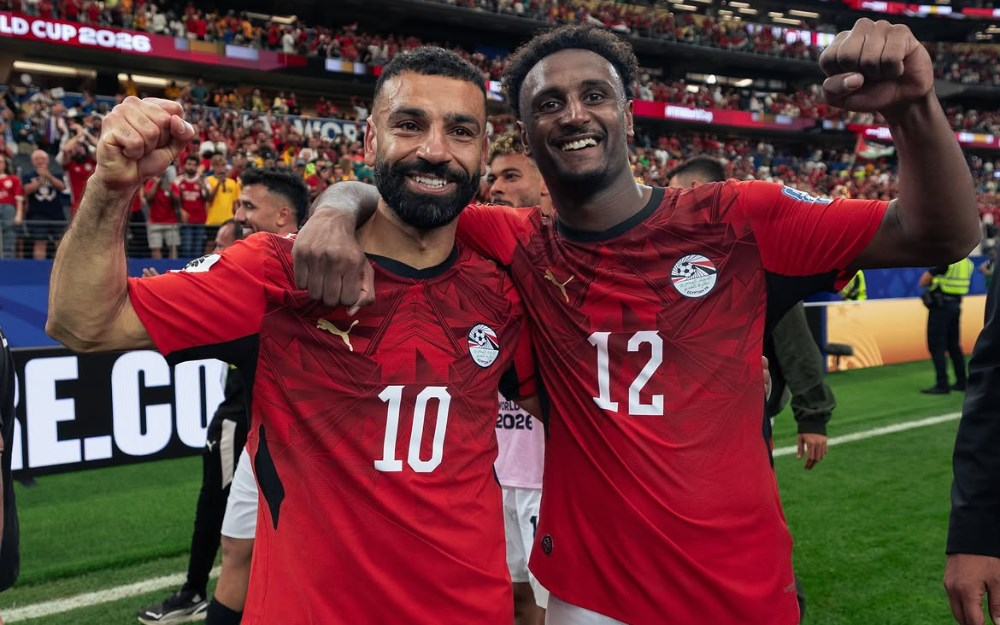

# Sons of the Nile — Egypt Dual-Nationality Scouting Dossier

**[▶ View the live dossier](https://abkr97a.github.io/egypt-scouting/)**

A data project that finds footballers eligible to play for **Egypt** who the federation
would otherwise never know about — the profile of *Haissem Hassan*, the Paris-born winger
Egypt discovered by luck weeks before the 2026 World Cup.

The result: **54 dual-nationality players under 26**, eligible under FIFA Article 9,
none yet cap-tied to a senior side — presented as an interactive scouting dossier with
career stats, transfer history, market-value trajectory, and pitch position.

---

## The problem

When Egypt called up Haissem Hassan in March 2026, it surprised everyone — he had a French
football upbringing and an Egyptian passport nobody was tracking. The tools scouts use don't
surface players like him:

- Player databases index a footballer by his **primary** nationality — a German-born son of
  an Egyptian shows a German flag, and Egypt never appears.
- Encyclopaedic sources only know players notable enough for an article — i.e. the ones who
  *already* declared. The undeclared prospect is invisible.

So these players are found by luck, if at all. This project finds them by method.

## The method

1. **Sweep** every club's squad across 27 countries where the Egyptian diaspora concentrates
   — Europe and the Gulf — reading each player's full nationality set, not just the primary one.
   (~47,000 players scanned.)
2. **Classify** eligibility with **FIFA Article 9**: only a *senior* competitive appearance
   ties a player to a country. Youth caps (U17/U19/U21/Olympic) leave the switch open — so a
   naïve "zero caps" filter would wrongly discard real prospects.
3. **Reach the hidden populations** that a senior-league sweep misses:
   - **Youth/academy teams** (U18/U19/U21/Primavera) — separate competitions where the
     youngest "next Hassan" prospects play.
   - **Free agents** — players with no current club, who fall off market-value-ranked indexes.
4. **Enrich** each match: club career stats (appearances, goals, assists, minutes), transfer
   history, and market-value trajectory over their career.
5. **Present** it as a scouting dossier — filterable by region, grouped by position, one card
   per player.

## What the data shows

- The diaspora concentrates in the **Gulf** (large Egyptian labour communities) and **Germany**,
  with clusters in France, Belgium, England and the Netherlands.
- Deeper league tiers matter — the most interesting undiscovered players sit in **3rd–6th tier
  and academy football**, not the top flight.
- Each expansion of coverage found fewer new players — a clear signal the search had become
  thorough, not just wider.

## Engineering notes

- **Verification-first.** Every parser was asserted against known-truth fixtures (real players
  whose values are visible) before any result was trusted — because a self-consistent output is
  not the same as a correct one.
- **Resilient collection.** Caching, retries with backoff, and resumable runs, because the data
  sources rate-limit aggressively.
- **Honest gaps.** Where a source genuinely doesn't expose a population (e.g. Spanish youth
  leagues aren't indexed as crawlable competitions), it's documented rather than faked.

## Disclaimer

A personal, non-commercial data project by AbdelRahman Mohammed. Player data is drawn from public football sources and
represents a **candidate list for human scouts to verify** — not an official eligibility ruling.
Not affiliated with the Egyptian Football Association or any club.

---

*Built by **AbdelRahman Mohammed** — data engineer · [LinkedIn](https://www.linkedin.com/in/abdelrahmanmohammedhassan/) · [GitHub](https://github.com/abkr97a)*
